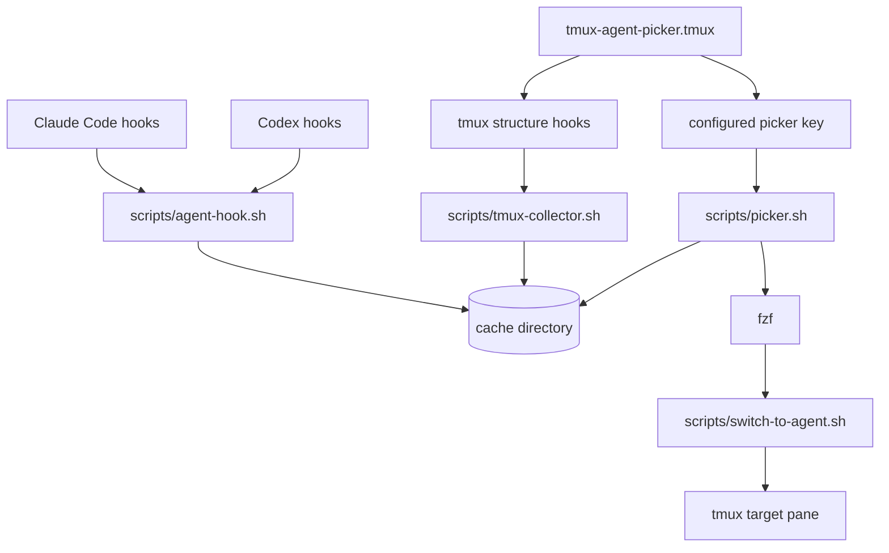

# tmux-agent-picker Design

## Architecture Overview



The system is event-driven. Tmux structure hooks update tmux metadata, while Claude/Codex hooks update agent lifecycle status. Both paths write to a shared cache. The picker reads the cache and switches to the selected pane.

Only live agents are shown in v1. The collector removes agent records whose `tmux.pane_id` no longer appears in the latest tmux pane snapshot, and `picker.tsv` is rebuilt from the remaining live records.

## Technology Stack

- Bash for plugin and hook scripts.
- tmux commands for pane/session/window metadata and navigation.
- jq for JSON hook payload parsing and cache transformation. jq is a required dependency in v1.
- fzf for the first picker UI.
- Atomic file writes using temporary files plus `mv`.
- Advisory locking with `flock` on Linux and a portable fallback using `mkdir` lock directories for macOS.

## Components

### tmux-agent-picker.tmux

- Defines default options:
  - `@agent-picker-key`: default `A`.
  - `@agent-picker-cache-dir`: default empty, resolves to XDG cache or `~/.cache/tmux-agent-picker`.
  - `@agent-picker-popup-width`: default `50%`.
  - `@agent-picker-popup-height`: default `50%`.
  - `@agent-picker-status-width`: default `12`.
  - `@agent-picker-agent-width`: default `10`.
  - `@agent-picker-title-width`: default `auto`; positive integers cap the dynamic title column.
  - `@agent-picker-cwd-width`: default `auto`; positive integers cap the dynamic cwd column.
  - `@agent-picker-tmux-width`: default `auto`; positive integers cap the dynamic tmux column.
- Binds the picker key to open `scripts/picker.sh` in a tmux popup.
- Registers tmux hooks that trigger `scripts/tmux-collector.sh --once`.

Initial tmux hooks:

- `session-created`
- `session-closed`
- `session-renamed`
- `after-new-window`
- `after-rename-window`
- `after-split-window`
- `after-kill-pane`
- `pane-exited`
- `after-resize-pane`
- `after-select-layout`
- `window-layout-changed`
- `window-pane-changed`
- `window-linked`
- `window-unlinked`
- `client-attached`
- `client-detached`
- `client-session-changed`
- `after-select-pane`
- `after-select-window`

`after-kill-window` is intentionally not registered because local tmux 3.6a rejects it as an unknown hook. Window removal is covered by `window-unlinked`, and pane/process cleanup is covered by `pane-exited` and `after-kill-pane`.

### scripts/agent-hook.sh

Stable hook entry point for Claude and Codex:

```text
agent-hook.sh <agent-type> <event-name>
```

Responsibilities:

- Drain JSON payload from stdin.
- Parse known fields once with jq.
- Dispatch agent-specific event mapping to `scripts/lib/agents/<agent-type>.sh`.
- Resolve tmux metadata from `TMUX_PANE` and tmux format strings.
- Upsert an agent record.
- Update only the status fields relevant to the event.
- Produce no stdout/stderr control output and always avoid changing agent behavior.

`agent-hook.sh` should stay thin. Agent-specific behavior belongs in adapters so new agent types can be added without growing one large conditional script.

Initial adapter layout:

```text
scripts/
  agent-hook.sh
  lib/
    agents/
      claude.sh
      codex.sh
      generic.sh
```

Each adapter produces a common normalized update:

```text
agent_type
agent_session_id
event_name
status
cwd
display_title_hint
tmux_pane_id
updated_at
```

Shared cache code applies the normalized update. For example, Claude-specific `Notification` subtype handling lives in `lib/agents/claude.sh`, while Codex-specific `PermissionRequest` behavior lives in `lib/agents/codex.sh`.

### scripts/tmux-collector.sh

Responsibilities:

- Collect live tmux pane metadata in one `tmux list-panes -a` call.
- Write `tmux-panes.json`.
- Reconcile `agents.json` by removing records whose pane no longer exists.
- Discover live Codex panes from tmux metadata and create temporary `codex:<pane-id>` records when no hook-created record exists yet.
- Remove Codex records when the owning pane still exists but its foreground command has returned to a shell after Codex exits.
- Rebuild `picker.tsv` for fast `fzf` startup, including only live-pane agents.

The collector should be cheap enough to run once per tmux hook event in v1. If hook storms become an issue, it can later be wrapped by a debounced singleton worker.

### scripts/picker.sh

Responsibilities:

- Ensure cache exists.
- Run the collector once before display to catch missed events.
- Read `picker.tsv`.
- Start `fzf` in the tmux popup.
- Render `picker.tsv` with fixed `status` and `agent` columns, then size `title`, `cwd`, and `tmux` from the longest visible values while keeping the total visible row width within the current popup/window width.
- Pass the selected agent id to `scripts/switch-to-agent.sh`.
- Close the picker popup after selection or cancel.
- If no live agents are present, display a short empty-state message and close without mutating cache state.

### scripts/switch-to-agent.sh

Responsibilities:

- Load the selected agent record.
- Validate that the pane still exists.
- Switch the current client to the recorded session/window/pane using stable ids when available: `switch-client -t <session_id>`, `select-window -t <window_id>`, and `select-pane -t <pane_id>`.
- Trigger a final collector pass if the pane is stale.

## Data Models

### Agent Record

Stored in `agents.json` as an object keyed by stable agent id:

```json
{
  "codex:abc123": {
    "id": "codex:abc123",
    "agent_type": "codex",
    "agent_session_id": "abc123",
    "display_title": "codex task",
    "cwd": "/path/to/repo",
    "status": "running",
    "tmux": {
      "session_id": "$1",
      "session_name": "work",
      "window_id": "@3",
      "window_index": "1",
      "window_name": "repo",
      "pane_id": "%12",
      "pane_index": "0"
    },
    "created_at": 1778410000,
    "updated_at": 1778410033,
    "last_seen_at": 1778410033,
    "source_event": "PreToolUse",
    "stale": false
  }
}
```

Stable id selection:

- Prefer hook payload session id when present.
- Fallback to `<agent-type>:<tmux-pane-id>` when no session id exists.

Display title selection:

Claude and Codex hooks do not expose a general agent session title in their lifecycle payloads. The picker title is therefore a derived display label, not canonical agent state.

Priority:

1. Tmux pane title, when present and not the default shell title.
2. Tmux window name.
3. First line of the most recent `UserPromptSubmit` prompt, truncated for display, when available.
4. Agent session id.

The prompt-derived fallback is optional display metadata. It must be capped to a short length and should not store full prompts.

### Tmux Pane Snapshot

Stored in `tmux-panes.json`:

```json
{
  "%12": {
    "session_id": "$1",
    "session_name": "work",
    "window_id": "@3",
    "window_index": "1",
    "window_name": "repo",
    "pane_id": "%12",
    "pane_index": "0",
    "pane_current_path": "/path/to/repo",
    "pane_current_command": "codex",
    "pane_title": "codex task"
  }
}
```

### Picker Rows

Stored in `picker.tsv`:

```text
<agent_id>\t<status_label>\t<agent_type>\t<display_title>\t<compact_cwd>\t<session:window.pane>
```

The rendered `fzf` line hides the first field and displays `status agent title cwd tmux`. Status labels include emoji for quick scanning, such as `🟢 idle`, `🔵 running`, `🟡 wait`, and `🔴 error`. The cwd display is compacted to the last two path components for deep paths, for example `.../personal/tmux-agent-picker`. The `status` and `agent` columns are fixed-width. The `title`, `cwd`, and `tmux` columns are measured from the current rows and shrunk when needed so the visible row fits the current popup/window width. Positive numeric `@agent-picker-title-width`, `@agent-picker-cwd-width`, and `@agent-picker-tmux-width` values are treated as per-column maximums; `auto` leaves them governed by row content and the total row cap.

Keeping TSV as a derived cache avoids expensive JSON processing during every picker redraw.

`picker.tsv` is a live index, not a history file. The collector excludes stale agent records by pruning them from `agents.json` before rebuilding this file.

## Cache Layout

```text
~/.cache/tmux-agent-picker/
  agents.json
  tmux-panes.json
  picker.tsv
  locks/
```

Writes use a temporary file in the same directory and `mv` into place. Scripts must create missing files with empty JSON objects or empty TSV content as appropriate.

## Hook Integration

### Claude Code

Claude hooks call:

```bash
bash ~/.tmux/plugins/tmux-agent-picker/scripts/agent-hook.sh claude SessionStart
bash ~/.tmux/plugins/tmux-agent-picker/scripts/agent-hook.sh claude UserPromptSubmit
bash ~/.tmux/plugins/tmux-agent-picker/scripts/agent-hook.sh claude PreToolUse
bash ~/.tmux/plugins/tmux-agent-picker/scripts/agent-hook.sh claude Stop
bash ~/.tmux/plugins/tmux-agent-picker/scripts/agent-hook.sh claude StopFailure
bash ~/.tmux/plugins/tmux-agent-picker/scripts/agent-hook.sh claude SessionEnd
bash ~/.tmux/plugins/tmux-agent-picker/scripts/agent-hook.sh claude PermissionRequest
bash ~/.tmux/plugins/tmux-agent-picker/scripts/agent-hook.sh claude Notification
```

Claude `SessionEnd` removes the agent record. This handles shells where the tmux pane remains open after the Claude process exits.

Claude notification handling:

- `permission_prompt`: `wait`
- `elicitation_dialog`: `wait`
- `idle_prompt`: no status change in v1
- `auth_success`: no status change
- `elicitation_complete`: no status change
- `elicitation_response`: no status change

### Codex

Codex hooks call:

```bash
bash ~/.tmux/plugins/tmux-agent-picker/scripts/agent-hook.sh codex SessionStart
bash ~/.tmux/plugins/tmux-agent-picker/scripts/agent-hook.sh codex UserPromptSubmit
bash ~/.tmux/plugins/tmux-agent-picker/scripts/agent-hook.sh codex PreToolUse
bash ~/.tmux/plugins/tmux-agent-picker/scripts/agent-hook.sh codex PostToolUse
bash ~/.tmux/plugins/tmux-agent-picker/scripts/agent-hook.sh codex PermissionRequest
bash ~/.tmux/plugins/tmux-agent-picker/scripts/agent-hook.sh codex Stop
```

Codex does not currently expose a session-exit hook. The collector handles process exit cleanup by pruning Codex records when their tmux pane foreground command is a shell such as `zsh`, `bash`, or `fish`.

The collector can also create a temporary Codex record keyed by pane id when it sees a live Codex foreground command before a Codex hook has created a session-id record. The first later hook event for the same pane replaces this temporary record.

## Design Decisions

- Use one generic agent hook entrypoint with agent adapters to avoid duplicating cache logic while keeping Claude/Codex-specific behavior isolated.
- Use JSON for canonical state because hook payloads are JSON and future fields can be added without changing file naming schemes.
- Use TSV as a derived picker index because shell and fzf handle tabular rows cheaply.
- Run the collector on tmux hook events and immediately before picker display to balance event-driven behavior with robustness.
- Prefer `TMUX_PANE` for hook ownership because it is the most direct bridge from an agent hook to a tmux pane.
- Show only live-pane agents in the picker because v1 is a navigation tool, not session history.
- Keep hooks output-silent because Claude and Codex can treat hook output and exit codes as behavior-control signals.

## Alternatives Considered

- File-per-agent status files: simpler shell writes, but harder to keep metadata consistent and harder to render sorted picker rows.
- Long-running daemon: better for debouncing and background indexing, but unnecessary for v1 and harder to install/debug.
- Process polling: useful as a fallback, but hook-driven updates are more precise and cheaper.
- New tmux window picker: simpler original implementation, but less ergonomic than keeping the picker over the current workspace.

## Non-Functional Requirements

- Hook handler target runtime should normally be below 100 ms.
- Picker startup should normally be below 300 ms for dozens of panes.
- Scripts must not fail agent operations when cache writes fail; they should exit 0 after best-effort logging.
- The cache must tolerate concurrent tmux and agent hook writes.
- No sensitive hook payload contents should be stored except stable ids, short derived display labels, cwd, status, and tmux location.
